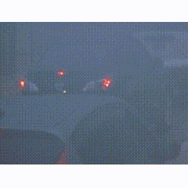

# Vehicle Intention Classification Using Visual Clues


`todo: link to proceedings`

## Leaderboard Evaluation Results

`todo: publish`




## Preparation

This repository relies heavily on various Docker containers. Please ensure that you have Docker installed in an up-to-date version.
To train the methods, you need to begin by extracting the individual images from the Waymo Open Perception dataset.

#### Download the Waymo Open Perception Dataset V2

You will need the following annotations from the Waymo Open Perception Dataset V2:
```
* camera_image
* projected_lidar_box
* lidar_box
* stats (required for evaluation)
```

#### Extract Train/Val/Test Images from the Waymo Open Dataset

To extract images of individual objects, please begin by building the 'vif_prepare' Docker container.
```bash
cd prepare
docker build -t vif_prepare .
```

Afterwards, execute the following command, setting $WAYMO_INPUT to point to the 'train' and 'val' split (execute both commands), and $WAYMO_OUTPUT to specify the directory where you want to export the images.

```bash
# extract train images
export WAYMO_INPUT="/path/to/waymo_parquets/train"
export WAYMO_OUTPUT="/path/to/exported/train"
docker run \
    -v $WAYMO_INPUT:/data_input \
    -v $WAYMO_OUTPUT:/data_output \
    -it vif_prepare /bin/bash -c "python3 waymo_extract_images.py /data_input /data_output"

# extract val images
export WAYMO_INPUT="/path/to/waymo_parquets/val"
export WAYMO_OUTPUT="/path/to/exported/val"
docker run \
    -v $WAYMO_INPUT:/data_input \
    -v $WAYMO_OUTPUT:/data_output \
    -it vif_prepare /bin/bash -c "python3 waymo_extract_images.py /data_input /data_output"
```

As an optional step for debugging, you can create videos for each extracted object within its scene using:

```bash
export VIDEO_INPUT="/path/to/exported/train/img"
export VIDEO_OUTPUT="/path/to/exported/train/vid"

docker run \
    -v $VIDEO_INPUT:/data_input \
    -v $VIDEO_OUTPUT:/data_output \
    -it vif_prepare /bin/bash -c "python3 waymo_extract_videos.py /data_input /data_output"
```

## Train Models

To train a model, start by downloading the annotations. Annotations for both training and validation are available in .pkl format under the releases tab. (Note: Annotations will be released after acceptance/presentation.)
Please note that we do not publish test annotations. For evaluating your method on the test set, refer to the evaluation section.

- `train_annotations.pkl`: Annotations for training scenes
- `val_annotations.pkl`: 101 annotations for validation (derived from validation scenes)

```bash
docker build -t vif_run .
```

To train a method adjust the settings in `train.py` and run the following command to start the training.
If you have multiple GPUs please adjust the `--gpus` flag accordingly.

```bash
export TRAIN_IMG="/path/to/exported/train/img"
export VAL_IMG="/path/to/exported/val/img"
export ANNOTATIONS="/path/to/downloaded/annotations"
export CODE="/path/to/code"

docker run \
    --network=host \
    -v $TRAIN_IMG:/data/images/train:ro \
    -v $VAL_IMG:/data/images/val:ro \
    -v $ANNOTATIONS:/data/annotations:ro \
    -v $CODE:/code:ro \
    --ipc=host \
    --gpus '"device=2"' \
    -it vif_run /bin/bash -c "python train.py /data/annotations/train_annotations_finished.pkl /data/annotations/val_annotations_finished.pkl /data/images/train/ /data/images/val/ vif --sequence_len=10"
```

## Evaluate Models

To evaluate models on the validation set, execute the following command.

```
export VAL_IMG="/path/to/exported/val/img"
export ANNOTATIONS="/path/to/downloaded/annotations"
export MODEL_CKPT="/path/to/trained/model.ckpt"
export CODE="/path/to/code"

docker run \
    --network=host \
    -v $VAL_IMG:/data/images/val:ro \
    -v $ANNOTATIONS:/data/annotations:ro \
    -v $MODEL_CKPT:/data/model_ckpt.pth:ro \
    -v $CODE:/code \
    --ipc=host \
    --gpus '"device=1"' \
    -it vif_run /bin/bash -c "python evaluate.py /data/annotations/val_annotations_finished.pkl /data/images/val/ /data/model_ckpt.pth"
```

## Submit Model for Testing

The test data split, consisting of 101 scenes derived from the validation split, will not be made publicly available. To evaluate your method on the test set, compose an email containing a link to a forked version of this GitHub repository that includes the model weights. Send the email to marvin.klemp@kit.edu.
We will run your model using the evaluate.py script on the test split and report results to you.
